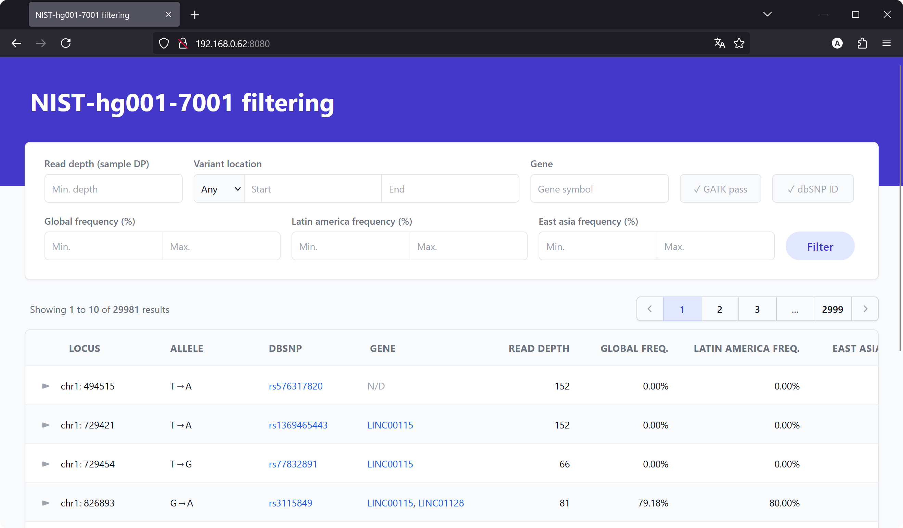
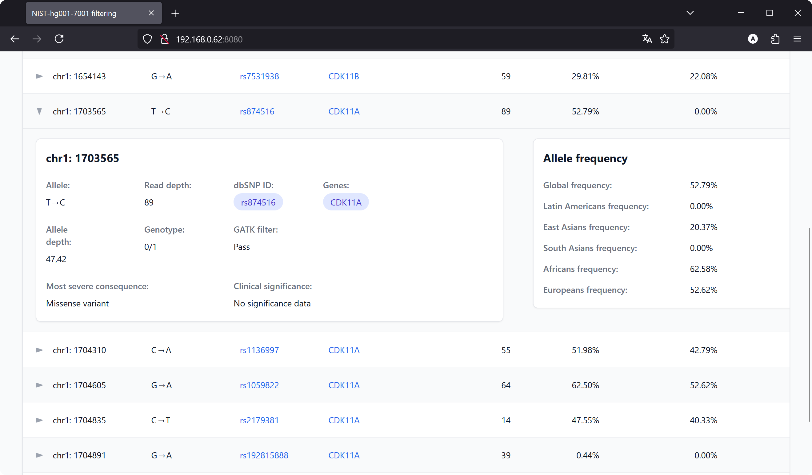

# Pipeline para anotação de variantes (VCF) e webapp interativa com resultado

<details>
  <summary>Screenshots do web app</summary>
  <p align="center">
    
  </p>
  <p align="center">
    
  </p>
</details>

Para rodar o web app pronto, clone o repositório e execute o comando abaixo na raiz do projeto.

```sh
docker compose up --build
```

O web app estará disponível em: <http://localhost:8080/>.

## Estrutura do projeto

Este projeto é composto por três componentes:

- `generate-database`: Inclui a pipeline para processar o arquivo de variantes em formato VCF, anotando-o e gerando a base de dados utilizada pela API.
- `api`: Contém a API que permite consultar e filtrar a base de dados de variantes anotadas. A API serve como uma ponte entre o banco de dados e o web app, fornecendo os dados das variantes para o aplicativo.
- `webapp`: Inclui o web app que permite visualizar e filtrar as variantes diretamente no navegador. O web app faz requisições à API conforme o usuário aplica filtros e navega pela tabela de variantes.

<p align="center">
  <picture>
    <source
      media="(prefers-color-scheme: dark)"
      srcset="figures/project-structure-dark.svg"
    />
    
  </picture>
</p>

## Processamento de arquivo VCF e geração do banco de dados

Os dados apresentados pelo web app são obtidos a partir de uma base de dados SQLite gerada a partir de um arquivo VCF anotado. O repositório já contem a base de dados em `api/NIST.dbsnp151.snpeff.alfa3.db`. Esse arquivo é gerado a partir do processamento do arquivo `NIST.vcf` fornecido inicialmente.

Para gerar a base de dados utilizada pela API do zero, entre no diretório `generate-database` e execute o script `scripts/download-input-data.sh` para baixar os seguintes arquivos:

- [`GRCh37.fa`](https://s3.amazonaws.com/biodata/collections/GRCh37/seq/GRCh37.fa): genoma de referência GRCh37.
- [`hg38.fa`](https://s3.amazonaws.com/biodata/collections/hg38/seq/hg38.fa): genoma de referência hg38.
- [`hg38.dbsnp151.vcf.gz`](https://storage.googleapis.com/broad-public-datasets/funcotator/funcotator_dataSources.v1.8.hg38.20230908s/dbsnp/hg38/hg38_All_20180418.vcf.gz): Arquivo VCF do banco de variantes [dbSNP](https://www.ncbi.nlm.nih.gov/snp/) (*build* 151), preparado pelo Broad Institute.
- [`snpeff_data`](https://snpeff.blob.core.windows.net/databases/v5_0/snpEff_v5_0_hg38.zip): Diretório contendo o banco de dados de referência do programa de anotação [SnpEff](https://pcingola.github.io/SnpEff/).
- [`alfa3.vcf.gz`](https://ftp.ncbi.nih.gov/snp/population_frequency/archive/release_3/freq.vcf.gz): Arquivo VCF do banco de dados[ALFA](https://www.ncbi.nlm.nih.gov/snp/docs/gsr/alfa/) (*release* 3), contendo frequências alélicas de variantes em diferentes populações humanas.

Por fim, execute a pipeline desenvolvida com o [Snakemake](https://snakemake.github.io/) via Docker. Essa pipeline irá processar os arquivos de entrada para gerar a base de dados como saída final (arquivo `NIST.dbsnp151.snpeff.alfa3.db`).

```sh
# O arquivo `NIST.vcf.gz` fornecido foi previamente descompactado e movido para
# o diretório `generate-database`. Foi necessário descompactar o arquivo por que
# a compressão não tinha sido realizada com o `bgzip`, o que é uma exigência
# do `bcftools`.
cd generate-database
bash scripts/download-input-data.sh
docker build -t generate-database .
docker run -it --rm -v $(pwd):/app -w /app generate-database snakemake --cores all
```

A pipeline do Snakemake está sumarizada no diagrama abaixo.

<details>
  <summary>Diagrama da pipeline do Snakemake</summary>
  <p align="center">
    <picture>
      <source
        media="(prefers-color-scheme: dark)"
        srcset="figures/snakemake-pipeline-dark.svg"
      />
      
    </picture>
  </p>
</details>

As principais etapas da pipeline serão descritas nas seções abaixo.

> [!NOTE]
> Embora fosse possível incluir o download de cada um desses arquivos como parte da pipeline do Snakemake, optei por fornecê-los separadamente para que a pipelina possa ser executada de forma isolada.

<details>
    <summary>Exemplo de regra do Snakemake para download de arquivo</summary>
    <pre><code>
rule download_hg38:
    output:
        "hg38.fa"
    log:
        stderr="logs/download_hg38.stderr",
    shell:
        """
        curl -LJZsf --retry 10 --retry-max-time 10 \
        https://s3.amazonaws.com/biodata/collections/hg38/seq/hg38.fa \
        > {output} 2> {log.stderr}
        """
    </code></pre>
</details>

### Mapeamento de variantes do genoma de referência GRCh37 para hg38

O arquivo NIST.vcf fornecido foi originalmente gerado a partir do mapeamento de *reads* no genoma de referência GRCh37 (conforme identificado no *header* do arquivo). Devido à maior disponibilidade de bancos de dados de anotação para o genoma hg38/GRCh38, foi necessário mapear as variantes do arquivo VCF para o genoma de referência hg38 (*lift over*).

Para isso, a pipeline utiliza o [`minimap2`](https://github.com/lh3/minimap2) para mapear o genoma hg38 no GRCh37. O arquivo PAF resultante é processado pelo comando `minimap2chain` do [`transanno`](https://github.com/informationsea/transanno), gerando um arquivo *chain* que descreve as transformações necessárias para mapear as coordenadas do genoma GRCh37 para hg38. Por fim, esse arquivo de cadeias foi fornecido para o comando `liftvcf` do `transanno` para produzir uma versão do arquivo `NIST.vcf` mapeada para hg38. Neste processo, 99.77% das variantes foram tranferidas com sucesso para o genoma hg38.

> [!NOTE]
> Nem sempre é possível determinar uma correspondência única entre as variantes do GRCh37 e do hg38. Isso ocorre, por exemplo, quando uma região do hg38 mapeia em múltiplas regiões do GRCh37. Nesses casos, o `transanno` reporta, por padrão, todas as possíveis correspondências. Para este projeto, optei por manter todas as correspondências possíveis, pois isso ocorreu para um número muito pequeno de variantes (aproximadamente 0.4%), a sua maioria em *scaffolds* não posicionados em cromossomos.

### Anotação de *rsIDs* (dbSNP *build* 151)

O arquivo `NIST.vcf` original contém anotações *rsID* do dbSNP, porém estas foram baseadas no dbSNP *build* 138, conforme documentado nos arquivos do [Genome in a Bottle](https://ftp-trace.ncbi.nlm.nih.gov/giab/ftp/data/NA12878/Nebraska_NA12878_HG001_TruSeq_Exome/). Considerando que essa versão foi lançada em 2003, optou-se por re-anotar as variantes usando um arquivo VCF do dbSNP *build* 151, disponibilizado pelo Broad Institute. Embora não seja a versão mais atual do dbSNP, este arquivo mostrou-se adequado para anotar a maioria das variantes do `NIST.vcf`. Além disso, apresenta duas vantagens práticas: é substancialmente menor que a versão mais recente (15.2G versus 25G do [arquivo da *build* 156](https://ftp.ncbi.nlm.nih.gov/snp/archive/b156/VCF/GCF_000001405.40.gz) do NCBI) e utiliza a mesma nomenclatura de cromossomos do genoma de referência hg38, diferentemente do arquivo do NCBI que usa *accessions* do GenBank.

A anotação das variantes do `NIST.vcf` foi realizada com o comando `annotate`, do [`bcftools`](https://samtools.github.io/bcftools/), o qual cria correspondências entre as variantes dos dois arquivos VCF com base nas posições genômicas das variantes (campos `CHROM` e `POS`) e no(s) alelo(s) alternativo(s) (campo `ALT`). Ao final do processo, a proporção de variantes do `NIST.vcf` com anotação do dbSNP (ou seja, com um *rsID* no campo `ID`) subiu de 95,94% para 99,53%.

### Anotação de genes (SnpEff)

A anotação das variantes com base na sua localização em loci gênicos é realizada utilizando a ferramenta SnpEff, que verifica a sobreposição das variantes com loci gênicos. Neste projeto, variantes localizadas fora das regiões transcritas (as quais incluem éxons, íntrons, 5'-UTR e 3'-UTR) não foram associadas a genes. Por padrão, o SnpEff atribui variantes situadas até 5 kb *upstream* ou *downstream* de um gene específico a esse mesmo gene, e variantes em regiões intergênicas são atribuídas aos genes mais próximos. Esse comportamento foi modificado utilizando os parâmetros `-no-upstream`, `-no-downstream`, e `-no-intergenic`.

Aproximadamente 95.57% das variantes foram associadas a pelo menos um gene, sendo 8.14% localizadas em loci que se sobrepõem a dois ou mais genes.

> [!NOTE]
> No diretório `generate-database/alternative-pipeline` encontra-se uma pipeline alternativa que utiliza anotações de genes a partir do GFF disponibilizado pelo banco [GENCODE](https://www.gencodegenes.org/human/) (*release* 47). Essas anotações são mais recentes do que as fornecidas pelo SnpEff. No entanto, as anotações do SnpEff foram escolhidas por três principais razões: (1) o SnpEff é uma ferramenta amplamente utilizada para anotação de variantes;
(2) permite anotações mais granulares, como a anotação de apenas éxons, de maneira simples; (3) ele realiza a predição do efeito da variante no gene.

### Anotação de frequências populacionais (ALFA *release* 3)

O banco de dados ALFA (*Allele Frequency Aggregator*) disponibiliza dados de frequências alélicas de variantes obtidas do [dbGaP](https://www.ncbi.nlm.nih.gov/gap/) em [12 populações humanas distintas](https://www.ncbi.nlm.nih.gov/snp/docs/gsr/data_inclusion/#population) em formato de arquivo VCF. Neste arquivo, cada população é representada como uma amostra (*ex.: SAMN10492695*) em uma coluna, com as informações que utilizei para calcular frequências alélicas (*tags AN e AN*) em seus campos. Como essas informações estavam nas colunas das amostras, optei por gerar um arquivo tabular TSV com uma linha por variante. Devido ao tamanho do arquivo VCF do ALFA, mantive apenas variantes presentes no `NIST.vcf` (pós-anotação com rsID do dbSNP). A correspondência entre variantes foi feita pelo campo `ID` (*rsID*), presente em todas as variantes do ALFA. Para realizar esse processo, a pipeline usa comandos `query` (para converter o VCF para o formato tabular) e `view` (para filtrar as variantes de acordo com o campo `ID`) do `bcftools`.

> [!NOTE]
> Em loci multialélicos, a frequência populacional do alelo alternativo foi calculada somando-se as frequências de todos os alelos alternativos presentes em cada locus. Na pipeline, isso é realizado por um comando `awk` que soma todos os valores separados por vírgula em um mesmo campo no arquivo VCF. Embora fosse ideal ter frequências separadas para cada alelo alternativo, isso aumentaria significativamente a complexidade do código.

### Geração da base de dados

Para facilitar a consulta e a filtragem de variantes, bem como o desenvolvimento subsequente de uma API para servir esses dados, as informações de interesse contidas em um arquivo VCF são transferidas para arquivos tabulares TSV. Isso é feito utilizando os comandos `bcftools query` e `SnpSift extractFields`. Os dados são divididos em três arquivos TSV: um contendo as anotações de *rsID* e outras informações sobre o processo de identificação de variantes (como profundidade de *reads* mapeados e identidade dos alelos), outro contendo as anotações de genes, e um terceiro contendo as frequências populacionais. O primeiro e o terceiro arquivos são gerados com o `bcftools query`, enquanto o segundo é gerado com o `SnpSift extractFields`, uma ferramenta da [`SnpSift`](https://pcingola.github.io/SnpEff/snpsift/introduction/), pois esse comando é capaz de extrair dados de interesse do campo `ANN` gerado pelo SnpEff, que contém a anotação de genes.

Os três arquivos TSV gerados pela pipeline são importados para um banco de dados SQLite. As estruturas das três tabelas do banco de dados são mostradas abaixo.

> [!NOTE]
> O SnpEff também anota variantes de acordo com o seu efeito predito no gene (ex.: mutações sinônimas, códon de parada antecipado, mutação em íntron, etc.), e essa informação também pode ser extraída utilizando o `SnpSift extractFields`. Para não aumentar a complexidade da pipeline e da API, decidi não incluir esta informação na base de dados SQLite. Ao invés disso, o web app obtém essa informação sob demanda, junto a informação do efeito clínico da variante, via a [API do Ensembl](https://rest.ensembl.org/documentation/info/variation_id). Essa API fornece a predição do efeito da mutação pelo [VEP](https://www.ensembl.org/info/docs/tools/vep/index.html) e dados de relevância clínica do [ClinVar](https://www.ncbi.nlm.nih.gov/clinvar/). O uso da API, em comparação a ter os dados diretamente na base de dados, apresenta duas principais limitações: (1) como esses dados são obtidas sob demanda (apenas quando a linha da tabela é expandida), não é possível filtrar variantes pelo seu efeito ou relevância clínica; (2) a predição do efeito da variante só está disponível para variantes associadas a variantes com *rsIS*.

#### Tabela de variantes

| Nome da coluna      | Tipo da coluna | Descrição                                       |
| ------------------- | -------------- | ----------------------------------------------- |
| dbsnp               | TEXT           | *rsID*                                          |
| chromosome          | TEXT           | Cromossomo                                      |
| pos                 | INTEGER        | Posição                                         |
| ref                 | TEXT           | Alelo de referência                             |
| alt                 | TEXT           | Alelo alternativo                               |
| qual                | REAL           | Métrica de qualidade da inferência do alelo     |
| filter              | TEXT           | Filtro de variações genômicas                   |
| gt                  | TEXT           | Genótipo                                        |
| dp                  | INTEGER        | Profundidade de *reads*                         |
| ad                  | TEXT           | Profundidade de *reads* dos alelos              |
| chromosome_position | TEXT           | String unindo a informação de `CHROM` e `POS` |

> [!NOTE]
> A profundidade de *reads* mapeados foi obtida a partir do campo `DP` na seção `FORMAT` do arquivo VCF, correspondente ao nível da amostra. Esse valor difere do campo `DP` presente na seção `INFO` do mesmo arquivo. O campo `DP` no nível da amostra representa a cobertura nessa amostra após a aplicação de filtros nos *reads* mapeados e a subamostragem em regiões de alta cobertura (o que explica o valor máximo de 250 no campo `DP` no nível da amostra).

#### Tabela de genes

| Nome da coluna      | Tipo da coluna | Descrição                                       |
| ------------------- | -------------- | ----------------------------------------------- |
| chromosome          | TEXT           | Cromossomo                                      |
| pos                 | INTEGER        | Posição                                         |
| gene                | TEXT           | Genes presentes na posição                      |
| chromosome_position | TEXT           | String unindo a informação de `CHROM` e `POS` |
| id                  | INTEGER        | Identificador numérico único para a linha       |

#### Tabela de frequências populacionais

| Nome da coluna   | Tipo da coluna | Descrição                                                                                                                               |
| ---------------- | -------------- | --------------------------------------------------------------------------------------------------------------------------------------- |
| dbsnp            | TEXT           | *rsID*                                                                                                                                  |
| european         | REAL           | Frequência total dos alelos alternativos na população "[*European*](https://www.ncbi.nlm.nih.gov/biosample/?term=SAMN10492695)"         |
| african_others   | REAL           | Frequência total dos alelos alternativos na população "[*African Others*](https://www.ncbi.nlm.nih.gov/biosample/?term=SAMN10492696)"   |
| east_asian       | REAL           | Frequência total dos alelos alternativos na população "[*East Asian*](https://www.ncbi.nlm.nih.gov/biosample/?term=SAMN10492697)"       |
| african_american | REAL           | Frequência total dos alelos alternativos na população "[*African American*](https://www.ncbi.nlm.nih.gov/biosample/?term=SAMN10492698)" |
| latin_american_1 | REAL           | Frequência total dos alelos alternativos na população "[*Latin American 1*](https://www.ncbi.nlm.nih.gov/biosample/?term=SAMN10492699)" |
| latin_american_2 | REAL           | Frequência total dos alelos alternativos na população "[*Latin American 2*](https://www.ncbi.nlm.nih.gov/biosample/?term=SAMN10492700)" |
| other_asian      | REAL           | Frequência total dos alelos alternativos na população "[*Other Asian*](https://www.ncbi.nlm.nih.gov/biosample/?term=SAMN10492701)"      |
| south_asian      | REAL           | Frequência total dos alelos alternativos na população "[*South Asian*](https://www.ncbi.nlm.nih.gov/biosample/?term=SAMN10492702)"      |
| other            | REAL           | Frequência total dos alelos alternativos na população "[*Other*](https://www.ncbi.nlm.nih.gov/biosample/?term=SAMN11605645)"            |
| african          | REAL           | Frequência total dos alelos alternativos na população "[*African*](https://www.ncbi.nlm.nih.gov/biosample/?term=SAMN10492703)"          |
| asian            | REAL           | Frequência total dos alelos alternativos na população "[*Asian*](https://www.ncbi.nlm.nih.gov/biosample/?term=SAMN10492704)"            |
| total            | REAL           | Frequência total dos alelos alternativos ao longo de [todas as populações](https://www.ncbi.nlm.nih.gov/biosample/?term=SAMN10492705)   |

> [!NOTE]
> A biblioteca [SQLModel](https://sqlmodel.tiangolo.com/), que foi utilizada para o desenvolvimento da API, exige que uma única coluna seja utilizada para fazer a correspondência entre duas tabelas (*foreign key*), assim, a coluna `chromosome_position` foi criada com o intuito de ser uma coluna comum às tabelas de variantes e de genes e cujos valores são únicos na tabela de variantes.

## API

A API oferece uma interface para consultar e filtrar as variantes presentes na base de dados SQLite gerada pela pipeline descrita acima. Desenvolvida com [FastAPI](https://fastapi.tiangolo.com/) (um framework para desenvolvimento de APIs em Python) e [SQLModel](https://sqlmodel.tiangolo.com/) (biblioteca que integra FastAPI com bancos de dados SQL), a API possui dois *endpoints*:

- `/n_variants/`: Retorna o número total de variantes na base de dados, após a aplicação de filtros.
- `/variants/`: Retorna uma lista de variantes e informações associadas, após a aplicação de filtros.

O *endpoint* `/n_variants/` é utilizado pelo web app para obter de forma rápida o número total de variantes na base de dados. Isso é utilizado para calcular o número total de páginas a serem exibidas na tabela de variantes, sem precisar recuperar todas as variantes de forma explícita.

Cada solicitação ao *endpoint* `/variants/` retorna, por padrão, uma lista com 10 variantes, que corresponde ao número de variantes exibidas em uma página do aplicativo web. O número de variantes retornadas pela API em cada solicitação é determinado pelo parâmetro `limit`. Isso melhora o desempenho do carregamento da página, pois torna a consulta ao banco de dados mais rápida e a resposta mais leve, já que não é necessário processar todos os dados no servidor Flask e armazená-los na memória. Para cada página, o aplicativo web faz uma nova solicitação ao *endpoint* `/variants/`, ajustando o valor do parâmetro `offset` em incrementos de 10.

### Parâmetros

Ambos os *endpoints* compartilham a maioria dos parâmetros, que são utilizados para filtrar as variantes retornadas. Os parâmetros comuns a `/n_variants/` e `/variants/` são:

| Parâmetro                 | Tipo da variável | Descrição                                                                                                                                          |
|---------------------------|------------------|----------------------------------------------------------------------------------------------------------------------------------------------------|
| dbsnp                     | str              | Retornar todas as variantes (`all`) ou apenas as com *rsID* (`only`). Padrão: `all`                                                                |
| gatk_pass                 | str              | Retornar todas as variantes (`all`) ou apenas as que passaram no filtro do GATK (`only`). Padrão: `all`                                            |
| chromosome                | str              | Retornar variantes em todos os cromossomos (`all`) ou em um cromossomo específico (ex.: `chr1`). Padrão: `all`                                     |
| min_dp                    | int              | Retornar variantes com profundidade de *reads* mapeados maior ou igual a um valor específico. Padrão: filtro não aplicado                          |
| min_pos                   | int              | Retornar variantes com posição genômica maior ou igual a um valor específico. Padrão: filtro não aplicado                                          |
| max_pos                   | int              | Retornar variantes com posição genômica menor ou igual a um valor específico. Padrão: filtro não aplicado                                          |
| gene                      | str              | Retornar variantes associadas a um gene específico. Padrão: filtro não aplicado                                                                    |
| min_total_alfa            | float            | Retornar variantes com frequência alélica mínima ao longo de todas as populações maior ou igual a um valor específico. Padrão: filtro não aplicado |
| max_total_alfa            | float            | Retornar variantes com frequência alélica máxima ao longo de todas as populações menor ou igual a um valor específico. Padrão: filtro não aplicado |
| min_latin_american_2_alfa | float            | Retornar variantes com frequência alélica maior ou igual a um valor específico em populações "*Latin American 2*". Padrão: filtro não aplicado     |
| max_latin_american_2_alfa | float            | Retornar variantes com frequência alélica menor ou igual a um valor específico em populações "*Latin American 2*". Padrão: filtro não aplicado     |
| min_east_asian_alfa       | float            | Retornar variantes com frequência alélica maior ou igual a um valor específico em populações "*East Asian*". Padrão: filtro não aplicado           |
| max_east_asian_alfa       | float            | Retornar variantes com frequência alélica menor ou igual a um valor específico em populações "*East Asian*". Padrão: filtro não aplicado           |

Os seguintes parâmetros são específicos do *endpoint* `/variants/`:

| Parâmetro | Tipo da variável | Descrição                                                                         |
|-----------|------------------|-----------------------------------------------------------------------------------|
| limit     | int              | Número máximo de variantes a serem retornadas. Padrão: `10`                       |
| offset    | int              | Número de variantes a serem ignoradas antes de retornar as variantes. Padrão: `0` |

> [!NOTE]
> Para este projeto, apenas as frequências populacionais ao longo de todas as populações (`total`), "*Latin American 2*" (`latin_american_2`), e "*East Asian*" (`east_asian`) foram incluídas como parâmetros de filtragem. No entanto, a API poderia ser facilmente expandida para incluir todos os parâmetros de frequência populacional disponíveis na base de dados.

### Exemplos

Os exemplos abaixo ilustram a utilização da API via linha de comando com o `curl`. Para iniciar a API com a porta 5555 exposta, execute os seguintes comandos dentro do diretório `api`:

```sh
docker build -t api .
docker run -it --rm -p 5555:5555 -v $(pwd):/app -w /app api fastapi dev --host 0.0.0.0 --port 5555
```

Para obter o número total de variantes na base de dados:

```sh
curl 'http://localhost:5555/n_variants/'
```

<details>
  <summary>Resposta da solicitação</summary>
  <pre><code>
29981
  </code></pre>
</details>

Para obter o número de variantes no cromossomo `chr13` que passaram nos filtros do GATK (ou seja, que têm o valor `PASS` no campo `FILTER`):

```sh
curl 'http://localhost:5555/n_variants/?chromosome=chr13&gatk_pass=only'
```

<details>
  <summary>Resposta da solicitação</summary>
  <pre><code>
439
  </code></pre>
</details>

Para obter os dados da primeira variante na base de dados:

```sh
curl 'http://localhost:5555/variants/?limit=1'
```

<details>
  <summary>Resposta da solicitação</summary>
  <pre><code>
[
  {
    "dbsnp": "rs576317820",
    "chromosome": "chr1",
    "pos": 494515,
    "ref": "T",
    "alt": "A",
    "filter": "GATKStandardMQ",
    "gt": "1/1",
    "dp": 152,
    "ad": "37,115",
    "genes": [
      "LOC100132287",
      "LOC100132062"
    ],
    "alfa": {
      "total": 0.0,
      "african": 0.0,
      "african_american": 0.0,
      "african_others": 0.0,
      "asian": 0.0,
      "east_asian": 0.0,
      "south_asian": 0.0,
      "other_asian": 0.0,
      "european": 0.0,
      "latin_american_1": 0.0,
      "latin_american_2": 0.0,
      "other": 0.0
    }
  }
]
  </code></pre>
</details>

Para filtrar por variantes no cromossomo `chrX` e com frequência alélica mínima de 0.5 em populações latinas americanas 2 (indivíduos com ancestralidade majoritariamente europeia e indígena) e 0.5 em populações asiáticas orientais, a solicitação seria a seguinte:

```sh
curl 'http://localhost:5555/variants/?limit=1&chromosome=chrX&min_latin_american_2_alfa=0.5&min_east_asian_alfa=0.5'
```

<details>
  <summary>Resposta da solicitação</summary>
  <pre><code>
[
  {
    "dbsnp": "rs28435956",
    "chromosome": "chrX",
    "pos": 312267,
    "ref": "A",
    "alt": "G",
    "filter": "PASS",
    "gt": "1/1",
    "dp": 12,
    "ad": "0,12",
    "genes": [
      "GTPBP6"
    ],
    "alfa": {
      "total": 0.9412409374473107,
      "african": 0.9186789772727273,
      "african_american": 0.9176514032496307,
      "african_others": 0.9444444444444444,
      "asian": 1.0,
      "east_asian": 1.0,
      "south_asian": 0.9893617021276596,
      "other_asian": 1.0,
      "european": 0.9456550275662904,
      "latin_american_1": 0.952054794520548,
      "latin_american_2": 0.9721311475409836,
      "other": 0.9382978723404255
    }
  }
]
  </code></pre>
</details>

Para obter uma variante associada ao gene [ADH1B](https://www.genecards.org/cgi-bin/carddisp.pl?gene=ADH1B&keywords=ADH1B):

```sh
curl 'http://localhost:5555/variants/?gene=adh1b&limit=1'
```

<details>
  <summary>Resposta da solicitação</summary>
  <pre><code>
[
  {
    "dbsnp": "rs1789882",
    "chromosome": "chr4",
    "pos": 99313896,
    "ref": "A",
    "alt": "G",
    "filter": "PASS",
    "gt": "1/1",
    "dp": 140,
    "ad": "2,138",
    "genes": [
      "ADH1B"
    ],
    "alfa": {
      "total": 0.8281483635155341,
      "african": 0.770481144343303,
      "african_american": 0.7693082605775688,
      "african_others": 0.8061224489795918,
      "asian": 0.9226190476190477,
      "east_asian": 0.9196428571428571,
      "south_asian": 0.8061224489795918,
      "other_asian": 0.9285714285714286,
      "european": 0.8324505842524844,
      "latin_american_1": 0.8554216867469879,
      "latin_american_2": 0.802547770700637,
      "other": 0.8293650793650794
    }
  }
]
  </code></pre>
</details>

Note que o parâmetro `gene` é insensível a letras maiúsculas e minúsculas.

## Web App

O web app foi desenvolvido para permitir a visualização e filtragem das variantes presentes no arquivo VCF anotado de forma intuitiva. Ele utiliza o *framework* [Flask](https://flask.palletsprojects.com/en/stable/) para fazer a comunicação com a API e o [Tailwind CSS](https://tailwindcss.com/) para a interface gráfica.

A interface consiste em dois elementos principais: um formulário com múltiplos campos para definição dos critérios de filtragem e uma tabela paginada para apresentação das variantes. Na tabela são exibidas apenas as variantes que atendem aos critérios de filtragem escolhidos, com linhas expansíveis que revelam informações detalhadas, como o efeito da variante no gene e sua relevância clínica (dados obtidos através da API do Ensembl, conforme mencionado anteriormente).

## Notas técnicas

- O gerenciador de pacotes [Pixi](https://pixi.sh/latest/) foi utilizado para criar as imagens Docker por conta da sua capacidade de instalar tanto bibliotecas de Python quanto ferramentas de linha de comando (como `bcftools` e `minimap2`). Por utilizar o ecossistema do [Conda](https://conda.org/community), o Pixi permite instalar pacotes do [BioConda](https://bioconda.github.io/), um repositório popular de pacotes de bioinformática.
